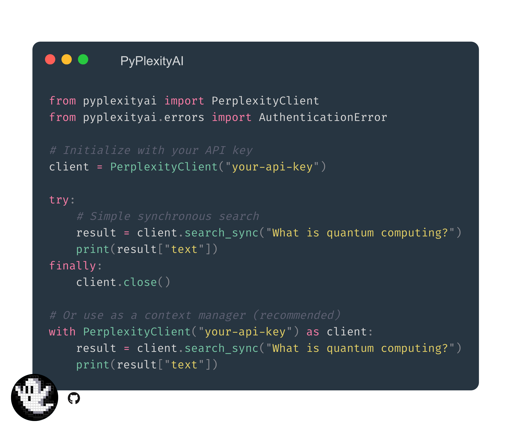

### PyPlexityAI

<p align="center">

<br>
<br>
</p>
<p align="center">            
<br>
<br>
<br>
A clean, lightweight, and modern Python client for <a href="https://docs.perplexity.ai/home">PerplexityAI's</a> API.
</p>

> <h4><details>
> <summary>Table of Contents (Click to expand)</summary>
>
>- [PyPlexityAI](#pyplexityai)
>    - [Performance](#performance)
>    - [Compatibility](#compatibility)
>    - [Installation](#installation)
>    - [Basic Usage](#basic-usage)
>    - [Features](#features)
>    - [Search Parameters](#search-parameters)
>    - [Model Matrix](#model-matrix)
>       - [Current Generation (Recommended)](#current-generation-recommended)
>       - [Model Selection Guide](#model-selection-guide)
>    - [Error Handling](#error-handling)
>    - [Streaming Support](#streaming-support)
>       - [Basic Streaming](#basic-streaming)
>       - [OpenAI-Compatible Streaming](#openai-compatible-streaming)
>       - [Async Streaming](#async-streaming)
>       - [Stream Processing](#stream-processing)
>       - [OpenAI Compatibility](#openai-compatibility)
>       - [Batch Processing](#batch-processing)
>       - [Model Selection](#model-selection)
>       - [Search Modes and Focus Areas](#search-modes-and-focus-areas)
>  - [Development](#development)
>  - [License](#license)
> </details></h4>

- Sync/Async API interfaces
- OpenAI-compatible streaming
- Model selection guide with performance benchmarks
- Robust error handling with detailed diagnostics

### Performance
- PyPy-optimized core components
- Connection pooling & automatic retries
- Efficient streaming support
- Zero-copy parsing for high throughput

### Compatibility
- Full OpenAI API schema support
- Automatic type conversion
- Context manager interfaces
- Cross-platform compatibility

## Installation

```bash
pip install pyplexityai  # Basic installation
pip install pyplexityai[async]  # With additional async support
```

## Basic Usage

```python
from pyplexityai import PerplexityClient
from pyplexityai.errors import AuthenticationError

# Initialize with your API key
client = PerplexityClient("your-api-key")

try:
    # Simple synchronous search
    result = client.search_sync("What is quantum computing?")
    print(result["text"])
finally:
    client.close()

# Or use as a context manager (recommended)
with PerplexityClient("your-api-key") as client:
    result = client.search_sync("What is quantum computing?")
    print(result["text"])
```

## Features

- Simple API key authentication
- Synchronous and streaming search modes
- Multiple model options
- Clean, typed codebase
- Robust error handling with detailed diagnostics
- OpenAI-compatible interface
- Async support
- No unnecessary dependencies
- **Built with PyPy and JIT-GIL enhancements for optimal performance**
- Optimized for high-throughput applications

> [!IMPORTANT]
> This library is not affiliated with Perplexity AI. It is a community-driven project.

## Search Parameters

| Parameter       | Type    | Default                  | Description                          |
|-----------------|---------|--------------------------|--------------------------------------|
| `mode`          | str     | "concise"                | "copilot" for detailed responses     |
| `search_focus`  | str     | "internet"               | Specialized sources (see below)      |
| `timeout`       | float   | 30.0                     | Seconds before timeout               |
| `model`         | str     | "sonar-pro"              | Model to use (see Model Matrix)      |

**Search Focus Options**: `internet`, `scholar`, `writing`, `wolfram`, `youtube`, `reddit`

## Model Matrix

| Model               | Context | Speed | Output Limit | Best For               | Type              |
|---------------------|---------|-------|--------------|------------------------|-------------------|
| sonar-reasoning-pro | 127k    | ⚡⚡⚡   | 8k           | Complex reasoning      | Chat Completion   |
| sonar-pro           | 200k    | ⚡⚡    | 8k           | General purpose        | Chat Completion   |
| sonar-reasoning     | 127k    | ⚡⚡⚡   | 4k           | Quick CoT responses    | Chat Completion   |
| sonar               | 127k    | ⚡⚡    | 4k           | Everyday conversations | Chat Completion   |

#### Current Generation (Recommended)
- `sonar-reasoning-pro`: Best for complex chain-of-thought reasoning (8k output limit)
- `sonar-pro`: General purpose model with 200k context window
- `sonar-reasoning`: Fast chain-of-thought responses
- `sonar`: Balanced everyday use model

#### Legacy Models (Deprecating February 22, 2025)
- `llama-3.1-sonar-small-128k-online`
- `llama-3.1-sonar-large-128k-online`
- `llama-3.1-sonar-huge-128k-online`

### Model Selection Guide
- Default model: `sonar-pro` (recommended for most use cases)
- Complex reasoning: `sonar-reasoning-pro`
- Quick responses: `sonar-reasoning`
- General chat: `sonar`
- Maximum context: `sonar-pro` (200k tokens)

## Error Handling

The client uses robust error handling with detailed diagnostics:

- `AuthenticationError`: API key validation issues
- `InvalidParameterError`: Invalid parameter values
- `SearchError`: Search request failures
- `PerplexityTimeoutError`: Request timeouts
- `WebSocketError`: WebSocket connection issues

```python
from pyplexityai import PerplexityClient
from pyplexityai.errors import (
    AuthenticationError,
    SearchError,
    InvalidParameterError,
    PerplexityTimeoutError,
)
```

*Each error includes:*
- Descriptive message
- Detailed causes
- Helpful hints
- Additional notes
- Error codes for programmatic handling

```python
try:
    with PerplexityClient("your-api-key") as client:
        result = client.search_sync("What is quantum computing?")
except AuthenticationError as e:
    print(f"Authentication failed: {e.message}")
    print(f"Hint: {e.hint_stmt}")
except InvalidParameterError as e:
    print(f"Invalid parameter: {e.message}")
    print(f"Valid values: {e.causes[-1]}")
except SearchError as e:
    print(f"Search failed: {e.message}")
    print(f"Causes: {e.causes}")
except PerplexityTimeoutError as e:
    print(f"Request timed out: {e.message}")
```

## Streaming Support

### Basic Streaming

```python
from pyplexityai import PerplexityClient

with PerplexityClient("your-api-key") as client:
    # Stream responses chunk by chunk
    for chunk in client.search("What is quantum computing?"):
        if "text" in chunk:
            print(chunk["text"], end="", flush=True)
```

### OpenAI-Compatible Streaming

```python
from pyplexityai import OpenAICompatibleClient, ChatMessage

client = OpenAICompatibleClient("your-api-key")

messages = [
    ChatMessage(role="user", content="Explain quantum computing", name=None)
]

# Stream tokens as they arrive
for response in client.create_chat_completion(
    messages=messages,
    model="sonar-pro",
    stream=True,
):
    if "delta" in response["choices"][0]:
        if content := response["choices"][0]["delta"].get("content"):
            print(content, end="", flush=True)
```

### Async Streaming

```python
from pyplexityai import AsyncPerplexityClient

async with AsyncPerplexityClient("your-api-key") as client:
    # Stream responses asynchronously
    async for chunk in client.async_search("What is quantum computing?"):
        if "text" in chunk:
            print(chunk["text"], end="", flush=True)
```

### OpenAI-Compatible Streaming

```python
from pyplexityai import OpenAICompatibleClient
from pyplexityai.client_types import ChatMessage

async with OpenAICompatibleClient("your-api-key") as client:
    messages = [
        ChatMessage(role="user", content="Explain quantum computing", name=None)
    ]

    # Stream tokens as they arrive
    async for response in client.acreate_chat_completion(
        messages=messages,
        model="sonar-pro",
        stream=True,
    ):
        if content := response.choices[0].delta.content:
            print(content, end="", flush=True)
```

### Batch Processing

```python
from pyplexityai import AsyncPerplexityClient
from pyplexityai.errors import PerplexityTimeoutError

async def batch_search(queries: list[str], api_key: str) -> dict[str, str]:
    results = {}
    async with AsyncPerplexityClient(api_key) as client:
        for query in queries:
            try:
                result = await client.async_search_sync(
                    query,
                    timeout=45.0  # Longer timeout for batch
                )
                results[query] = result["text"]
            except PerplexityTimeoutError:
                results[query] = "Error: timeout"
                continue
    return results

# Example batch processing
queries = [
    "What is Python?",
    "What is JavaScript?",
    "What is Rust?"
]
results = await batch_search(queries, "your-api-key")
for query, result in results.items():
    print(f"\nQuery: {query}")
    print(f"Result: {result}")
```

### Model Selection

```python
from pyplexityai import PerplexityClient

with PerplexityClient("your-api-key") as client:
    # Use reasoning-optimized model
    result = client.search_sync(
        "Explain the implications of quantum entanglement",
        model="sonar-reasoning-pro"
    )
    print(result["text"])

    # Use general purpose model with streaming
    for chunk in client.search(
        "Write a Python function to implement quicksort",
        model="sonar-pro"
    ):
        if "text" in chunk:
            print(chunk["text"], end="", flush=True)
```

### Search Modes and Focus Areas

```python
from pyplexityai import AsyncPerplexityClient

async with AsyncPerplexityClient("your-api-key") as client:
    # Copilot mode (more detailed responses)
    async for chunk in client.async_search(
        query="Explain how BERT works",
        mode="copilot",
        model="sonar-pro"
    ):
        if "text" in chunk:
            print(chunk["text"], end="", flush=True)

    # Scholar focus (academic sources)
    result = await client.async_search_sync(
        query="Latest developments in fusion energy",
        mode="concise",
        search_focus="scholar"
    )
    print(result["text"])
```

## Development

```bash
# Create virtual environment
uv venv --python pypy

# Activate virtual environment
source .venv/bin/activate

# Install development dependencies
uv pip install -e ".[dev]"

# Run tests
uv run test.py  # Run all tests
uv run test.py errors  # Run specific test(s)

# Run type checks
pyright  # Strict type checking

# Run linter
ruff check . --fix --unsafe-fixes

# Run formatter
ruff format .
```

## License

This project is licensed under the MIT License. See the [LICENSE](LICENSE) file for details.

